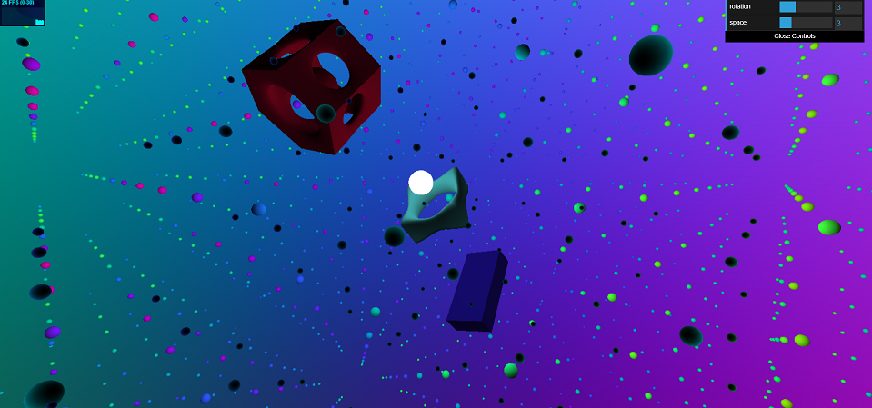
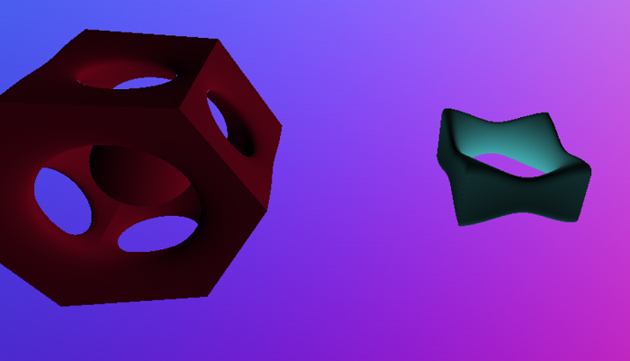
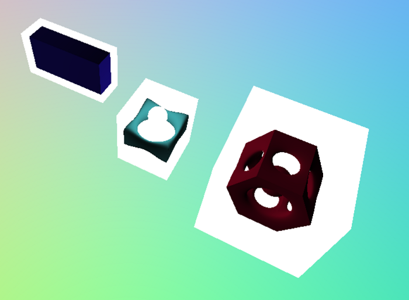
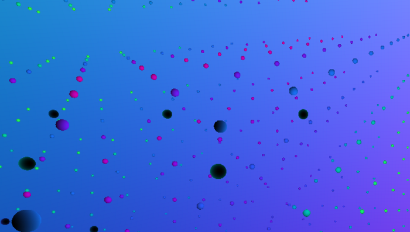
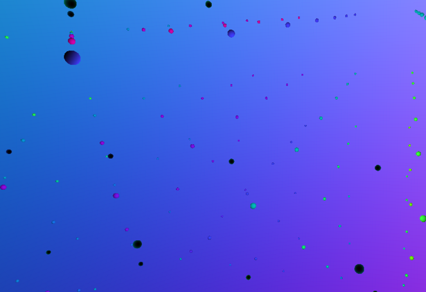

# Space

Clemen Deng (PennKey: clemen)

This project is created using ray marched signed distance functions. Viewing this project
requires a WebGL capable browser.

[WebGL link](https://clemendeng.github.io/hw02-raymarching-sdfs/)

## Resources
Inigo Quilez's info on [palettes](https://iquilezles.org/www/articles/palettes/palettes.htm) and [signed distance functions](http://www.iquilezles.org/www/articles/distfunctions/distfunctions.htm)

Jamie Wong's [ray marching signed distance functions](http://jamie-wong.com/2016/07/15/ray-marching-signed-distance-functions/)

## Features

#### Signed Distance Functions
This includes a number of primitives, time-based transformation operations of rotation and translation, and the SDF operations repetition, smooth subtraction, and smooth intersection. The following image shows a smooth subtraction SDF on the left and a smooth intersection SDF on the right.

#### Bounding Volumes
These were used for each SDF to make ray marching much more efficient. I did attempt to implement bounding volume hierarchies, but since I was transforming my geometries I concluded that doing this dynamically would be much too complicated for this assignment. I did look at an article on [Wikipedia](https://en.wikipedia.org/wiki/Bounding_volume_hierarchy) as well as a [paper](http://www-ljk.imag.fr/Publications/Basilic/com.lmc.publi.PUBLI_Inproceedings@117681e94b6_1860ffd/bounding_volume_hierarchies.pdf) on this topic. Note: this project runs much faster if the little star balls are removed, because their bounding box is extremely large so pretty much all rays will march against that SDF. To view without them, uncomment the code on line 348 of flat-frag.glsl. Bounding volumes are shown here:

#### Animation
The scene is very animated. The little star balls move slowly, there are rotating objects about the center point. There is not a single still object. Rotation, translation, even the light position moves, which will be talked about later on. Toolbox functions used in animation include sine curves and the gain function.

#### Procedural Texturing
The little star balls were procedurally colored using a perlin noise function as their basis. The noise was inputted into a color spectrum. Resulting appearance:

#### GUI Elements
The user can modify two attributes of the scene, rotation and space. Rotation alters the rotation speed of the objects, and space alters the spacing of the little star balls in the scene. Here are the balls with greater space:

#### Normal Based Shading
The objects were shaded based on their normals, calculated using a gradient function from [Jamie Wong](http://jamie-wong.com/2016/07/15/ray-marching-signed-distance-functions/). The light is animated to coincide with a sphere, making it appear as if the sphere is emissive:

###### Question
I was going to add more rotating geometry to made the scene more cohesive but I think Chrome was using up literally all of my laptop's memory so loading the scene excruciating. Is there a fix for this other than just freeing up RAM / restarting Chrome? Do I just not have a good enough computer?